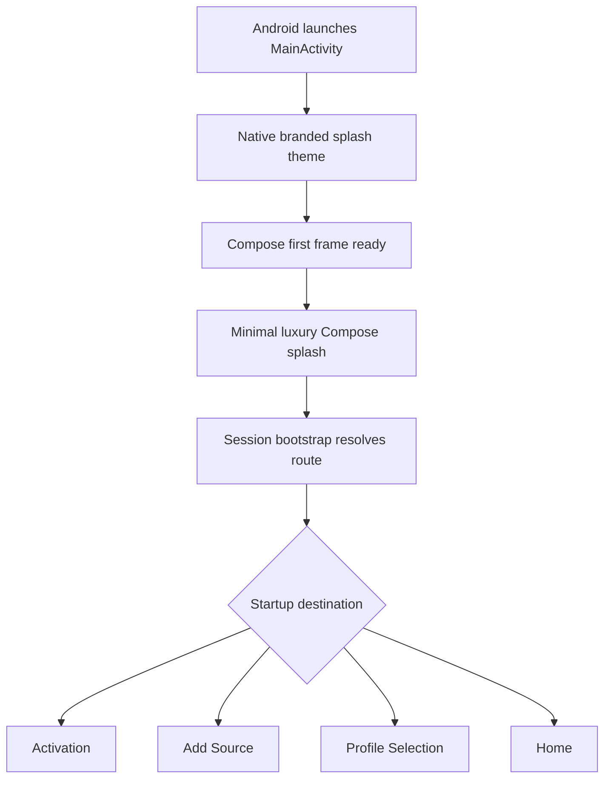

# Native Splash Redesign Plan

## Recommended Approach
Use the Android SplashScreen API plus matching Compose branding. A theme-only launch drawable would hide the black screen, but the SplashScreen API is the correct native bridge on modern Android and keeps launch behavior consistent across TV devices. I will also make the in-app splash timing less wasteful by running the minimum display delay in parallel with startup work instead of after it.

## Current Findings
- The black screen comes from [`app/src/main/res/values/themes.xml`](app/src/main/res/values/themes.xml), where `Theme.IptvCinema` uses `android:windowBackground` as pure black.
- [`app/src/main/java/com/iptvcinema/tv/app/MainActivity.kt`](app/src/main/java/com/iptvcinema/tv/app/MainActivity.kt) renders Compose directly and does not call `installSplashScreen()`.
- [`app/src/main/java/com/iptvcinema/tv/features/splash/SplashViewModel.kt`](app/src/main/java/com/iptvcinema/tv/features/splash/SplashViewModel.kt) waits for session bootstrap, then waits another 2 seconds before navigating.
- [`app/src/main/res/mipmap-anydpi-v26/ic_launcher.xml`](app/src/main/res/mipmap-anydpi-v26/ic_launcher.xml) and [`app/src/main/res/drawable/tv_banner.xml`](app/src/main/res/drawable/tv_banner.xml) are simple placeholder vectors.

## Design Direction
Minimal luxury: deep blue-black / graphite surfaces, a restrained champagne-gold play or aperture mark, quiet contrast, and no busy poster imagery. The splash, app icon, TV banner, and shared `CinemaLogo` should feel like one brand system rather than separate placeholders.

## Implementation Steps
1. Add native splash support.
   - Add `androidx.core:core-splashscreen` to [`gradle/libs.versions.toml`](gradle/libs.versions.toml) and [`app/build.gradle.kts`](app/build.gradle.kts).
   - Create a `Theme.IptvCinema.Splash` in [`app/src/main/res/values/themes.xml`](app/src/main/res/values/themes.xml) with dark branded background, splash icon, and `postSplashScreenTheme` back to `Theme.IptvCinema`.
   - Update [`app/src/main/AndroidManifest.xml`](app/src/main/AndroidManifest.xml) so `MainActivity` starts with the splash theme.
   - Call `installSplashScreen()` before `super.onCreate()` in [`MainActivity.kt`](app/src/main/java/com/iptvcinema/tv/app/MainActivity.kt).

2. Redesign the brand assets.
   - Replace the placeholder launcher icon with a proper adaptive icon setup: background color layer plus foreground mark.
   - Redesign [`tv_banner.xml`](app/src/main/res/drawable/tv_banner.xml) as a clean 16:9 TV banner with the same mark and app name.
   - Add a reusable vector drawable for the native splash icon so launch, icon, and banner share the same visual language.

3. Redesign the Compose splash screen.
   - Update [`SplashScreen.kt`](app/src/main/java/com/iptvcinema/tv/features/splash/SplashScreen.kt) to match the minimal-luxury direction: centered mark, refined title, subtle atmosphere, current tagline/loading copy.
   - Reuse or update [`CinemaLogo.kt`](app/src/main/java/com/iptvcinema/tv/core/design/components/CinemaLogo.kt) so the in-app brand mark aligns with launcher assets.

4. Improve perceived launch speed.
   - Change [`SplashViewModel.kt`](app/src/main/java/com/iptvcinema/tv/features/splash/SplashViewModel.kt) so startup bootstrap and minimum splash duration run concurrently.
   - Keep routing behavior unchanged: Activation, Add Source, Profile Selection, or Home still comes from existing session state.

5. Verify.
   - Run a Gradle build/check for compile errors.
   - Check edited files with lints.
   - If an Android device/emulator is available, launch once cold to confirm native splash appears immediately before Compose splash.

## Flow

## Expected Result
Cold launch should show the branded native splash immediately instead of a black screen, then transition into a visually matching Compose splash. The app icon and Android TV banner should look production-ready and consistent with the app's premium cinema design system.
