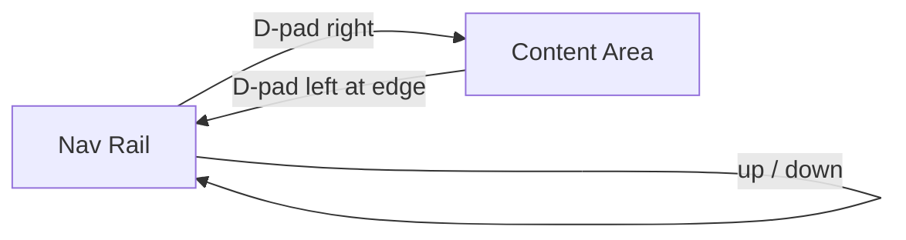

# IPTV Cinema - Premium Blue Redesign Concept (Android TV)

A complete, original, production-ready redesign of IPTV Cinema for the 10-foot
TV experience. The system is inspired by the layout logic of premium streaming
platforms but is visually original: a deep cinematic dark canvas, an electric
blue accent, a left expanding navigation rail, large hero banners, and strong
horizontal content rails.

No copyrighted brand colors, logos, marks, or screens are reproduced. No
references to illegal streaming.

---

## 1. Full redesigned UI concept

### Design language

```text
Deep space-black canvas + electric blue accent + glass panels + poster-led browsing
```

The interface reads as a calm, premium "command center" for entertainment.
Chrome is minimal; content is the hero. Every surface is dark so artwork pops,
and a single electric-blue accent carries focus, selection, and primary action.
A red accent is reserved exclusively for the LIVE state so "live" is instantly
recognizable.

### Design keywords

- Cinematic, premium, immersive
- Calm and uncluttered
- High contrast, 10-foot readable
- Remote-first, obvious focus
- Original (not a clone)

### Accent strategy

- Primary accent: electric blue. Used for focus glow, selected nav, primary
  buttons, progress fills, key highlights.
- Live accent: red. Used only for LIVE badges and live progress.
- Secondary warmth: a restrained champagne gold, used sparingly for premium
  flourishes (e.g. top-rated/awards), never competing with blue.
- Neutrals: near-black backgrounds, graphite surfaces, white and muted-gray text.

---

## 2. Screen-by-screen layout

### 2.1 Launcher / Splash

```text
[ centered ]
  Brand mark (glowing play / cinema-light motif)
  IPTV Cinema  (electric-blue display title)
  tagline (muted)
  loading indicator (blue)

Background: near-black radial wash with two soft blue corner glows.
No nav, no clutter.
```

Purpose: a short cinematic hold while the session resolves the startup
destination. The brand mark sits center with a soft blue bloom behind it.

### 2.2 Login Method

```text
Background: abstract cinematic blue gradient (corner glows + vignette)

Title: "How do you want to sign in?"
Row of large TV cards:
  [ Xtream Codes ]   [ M3U Playlist ]   [ Continue as profile ]
   icon + title         icon + title        avatar + name
   short helper text    short helper text   "Resume your session"

Footer: remote hints
```

Cards are large (min ~360x220), focus-scaled with a blue glow. D-pad moves
horizontally between the three entry points.

### 2.3 Home

```text
+-----+--------------------------------------------------+
|     |  HERO BANNER (featured movie/series/channel)     |
| nav |   Title (display)                                |
| rail|   badges: 4K - rating - LIVE                     |
|     |   meta: year - genre - duration                  |
|     |   description (2-3 lines)                         |
|     |   [ Play ]  [ More Info ]  [ + Favorite ]        |
|     +--------------------------------------------------+
|     |  Continue Watching  > > >                        |
|     |  Live Now           > > >                        |
|     |  Popular Movies     > > >                        |
|     |  Trending Series    > > >                        |
|     |  Recently Added     > > >                        |
|     |  Favorites          > > >                        |
+-----+--------------------------------------------------+
```

Vertical scroll moves between hero and rails; horizontal scroll moves within a
rail. The focused card scales up with a blue glow and lifts above neighbors.

### 2.4 Live TV

```text
+-----+------------+----------------------------------+
|     | CATEGORIES | PREVIEW (currently playing)      |
| nav |  All       |   channel logo + name            |
| rail|  News      |   NOW: program title  [progress] |
|     |  Sports    |   NEXT: program title            |
|     |  Movies    |   [ Watch ]  [ + Favorite ]      |
|     |  Kids      +----------------------------------+
|     |  ...       | CHANNEL LIST / GRID              |
|     |            |  [logo] name  LIVE  now-playing  |
|     |            |  [logo] name  LIVE  now-playing  |
+-----+------------+----------------------------------+
```

Three focus zones: categories (left), preview/actions (top-right), channel
list (bottom-right). LIVE badge is red; focus is blue.

### 2.5 Movie Details

```text
Full-bleed backdrop (top), darkened with bottom gradient
+----------+-------------------------------------------+
| POSTER   | Title (display)                           |
| card     | badges: 4K - rating                       |
|          | meta: year - genre - duration             |
|          | description                               |
|          | [ Play ] [ Trailer ] [ + Favorite ]       |
|          | Cast: face placeholders + names           |
+----------+-------------------------------------------+
  Similar Movies  > > >
```

### 2.6 Series Details

```text
Full-bleed backdrop hero with series metadata + [ Continue Watching ]
Season selector: [ S1 ] [ S2 ] [ S3 ] ...
Episode cards (vertical/grid):
  [thumb] Ep 1 - Title        42m   [progress]
  [thumb] Ep 2 - Title        45m   [progress]
Similar Series  > > >
```

### 2.7 Search

```text
+-----+----------------------+--------------------------+
|     | ON-SCREEN KEYBOARD   | Filter tabs:             |
| nav | Q W E R T Y ...      | [All][Movies][Series][Ch]|
| rail| A S D F G H ...      +--------------------------+
|     | space  del  clear    | Recent searches (chips)  |
|     | [ Voice search ]     | Results grid             |
+-----+----------------------+--------------------------+
```

### 2.8 Settings

```text
+-----+----------------+------------------------------+
|     | MENU           | DETAIL PANEL                 |
| nav | Profiles       |  rows / toggles / actions    |
| rail| Playlists      |                              |
|     | Parental       |                              |
|     | Language       |                              |
|     | Playback       |                              |
|     | EPG refresh     |                              |
|     | Logout         |                              |
+-----+----------------+------------------------------+
```

---

## 3. Component system

| Component | Role | Key states |
|-----------|------|-----------|
| `CinemaNavRail` | Left vertical navigation | collapsed (icons), focused (expanded + labels), selected (blue pill) |
| `CinemaButton` | Primary/secondary/danger/ghost/icon actions | focus glow + scale, pressed, disabled |
| `FocusableCinemaCard` | Base focus wrapper for all tiles | default border, focus (blue border + glow + 1.04 scale), pressed (0.98) |
| `HeroBanner` | Featured content | static; inner CTAs focusable |
| `ContentRail` | Horizontal row of cards | per-card focus |
| `PosterCard` | Movie/series tile | progress bar, badges, focus |
| `ChannelTile` | Live channel tile | LIVE badge (red), now-playing, focus |
| `SearchKeyboard` | TV keyboard | key focus, voice button |
| `Skeleton*` | Loading placeholders | shimmer |
| State screens | Empty / error / loading | icon + message + action |

### Color tokens (electric blue)

```kotlin
Background    = #05080B   // near-black
BackgroundSoft= #081018
Surface       = #10161C
SurfaceSoft   = #151B22
SurfaceGlass  = #CC121820

Accent        = #3DA9FC   // electric blue (primary)
AccentSoft    = #8FD0FF
AccentDeep    = #1E6FD9
AccentGlow    = #3DA9FC
FocusBorder   = #6FC2FF

Gold          = #FFC95C   // sparing secondary warmth only
LiveRed       = #E02424   // LIVE only

TextPrimary   = #F4F7FA
TextSecondary = #B8C0C8
TextMuted     = #747B83
```

### Typography hierarchy (TV scale)

```text
Display title : 56-72sp  (hero / brand)
Page title    : 42-56sp
Section title : 24-30sp
Body          : 18-22sp
Metadata      : 14-18sp
Button        : 18-22sp
```

### Spacing & shape

```text
Screen padding (overscan safe): 48dp horizontal / 32dp vertical
Section gap: 32dp   Rail gap: 24dp   Card gap: 18dp   Button gap: 16dp
Shapes: Small 10dp, Medium 16dp, Large 24dp, XLarge 32dp
```

---

## 4. Navigation behavior

Left vertical rail, remote-first:

```text
[ avatar ]   <- profile (top)
  Home
  Live TV
  Movies
  Series
  Favorites
  Search
  Settings
```

- Idle: icon-only, ~72dp wide.
- Focused: rail expands to ~240dp and reveals labels, overlaying content with a
  scrim so nothing reflows.
- Selected item shows a persistent blue pill + blue icon tint.
- D-pad up/down moves within the rail; right enters content; left from the
  leftmost content column returns to the rail with focus restored to the
  selected item.



---

## 5. Focus-state rules

```text
Default : 1px subtle border, no glow, scale 1.0
Focused : 2px electric-blue border + blue glow shadow + scale 1.04 + raised z
Pressed : scale 0.98
Selected: blue pill / blue tint (persists regardless of focus)
Disabled: ~40% opacity, no glow
```

Rules:
- Focus is never communicated by color alone (always border + scale + glow).
- Exactly one focus target is obvious at any time.
- Text remains fully readable in every state.

---

## 6. Suggested animations

- Focus scale: `tween(150ms)` ease; glow fades in with the same timing.
- Nav rail expand/collapse: `animateDpAsState`, ~200ms, with label fade-in.
- Rail scrim: fade 0 -> ~0.4 alpha as the rail expands.
- Hero crossfade when the featured item changes: ~300ms.
- Rail/list item entrance: subtle staggered fade/translate on first load.
- Skeleton shimmer: looping horizontal gradient.
- Keep motion subtle and fast; never block remote input.

---

## 7. Android TV implementation notes

- Built on Jetpack Compose for TV (`androidx.tv.material3`), Hilt, Media3,
  Coil, Navigation Compose.
- Leanback launcher intent + `tv_banner`; landscape locked.
- All interactive elements use `FocusableCinemaCard` (handles focus, key
  events, scale, glow) so focus behavior is consistent app-wide.
- Use `LazyRow`/`LazyColumn`/`LazyVerticalGrid` for rails, lists, and the EPG;
  render only the visible window for performance.
- Respect overscan with `CinemaSpacing.ScreenPadding`.
- Centralize all color through `CinemaColors` so the accent is a single source
  of truth.
- Avoid dense forms; prefer large cards and steppers over typed input where
  possible.

---

## 8. Compose structure (mapped to existing files)

| Screen / element | File |
|------------------|------|
| App shell + nav rail | `core/design/components/CinemaScreen.kt` (`CinemaScreen`, `CinemaNavRail`) |
| Main shell wiring | `core/navigation/MainShellScaffold.kt` |
| Nav items | `core/navigation/NavItem.kt` |
| Theme / tokens | `core/design/theme/CinemaColors.kt`, `CinemaTheme.kt`, `CinemaTypography.kt`, `CinemaSpacing.kt`, `CinemaShapes.kt` |
| Focus wrapper | `core/design/components/FocusableCinemaCard.kt` |
| Buttons | `core/design/components/CinemaButton.kt` |
| Hero | `core/design/components/HeroBanner.kt` |
| Rails / posters | `core/design/components/ContentRail.kt`, `PosterCard.kt` |
| Live TV | `core/design/components/LiveTvComponents.kt`, `ChannelTile.kt` |
| Details | `core/design/components/DetailComponents.kt` |
| Search | `features/search/SearchScreen.kt`, `core/design/components/SearchKeyboardLayouts.kt` |
| Settings | `features/settings/SettingsScreen.kt`, `core/design/components/SettingsComponents.kt` |
| Splash | `features/splash/SplashScreen.kt` |
| Login method | `features/sources/SourceScreens.kt`, `core/design/components/SourceCards.kt` |
| States/skeletons | `core/design/components/SkeletonComponents.kt`, `features/states/StateScreens.kt` |

Example shell composition:

```kotlin
@Composable
fun CinemaScreen(/* nav callbacks */) {
    Row(Modifier.fillMaxSize().background(cinemaBackgroundBrush())) {
        if (showNav) CinemaNavRail(selected, onNavigate, onProfileClick)
        Column(Modifier.weight(1f).padding(/* overscan */)) {
            Box(Modifier.weight(1f)) { content() }
            if (showRemoteHints) RemoteHintBar(hints)
        }
    }
}
```
